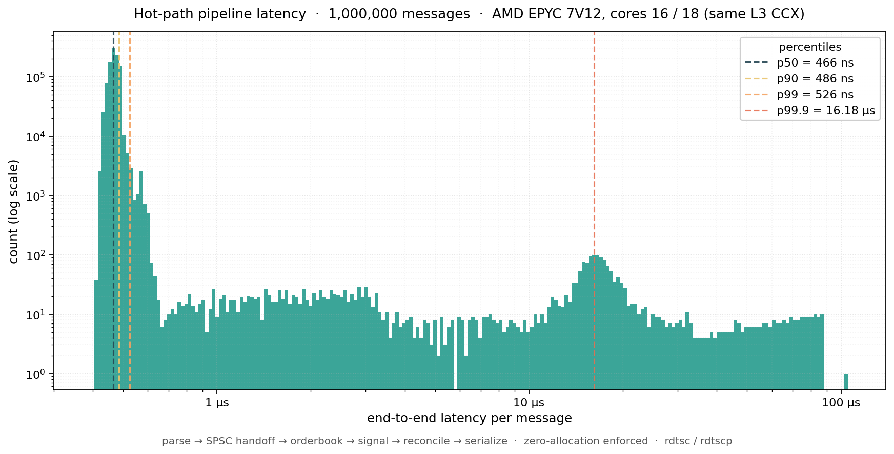

<div align="center">

# Kalshi Trading Engine

**A low-latency C++20 trading stack for the Kalshi prediction market, with a conformant exchange simulator to benchmark against.**

[](#measured-results)

[](./CMakeLists.txt) [](#platform) [](https://www.boost.org/doc/libs/release/libs/asio/) [](https://www.boost.org/doc/libs/release/libs/beast/) [](https://www.openssl.org/) [](https://github.com/simdjson/simdjson) [](https://github.com/google/benchmark) [](./LICENSE)

<br />

[Results](#measured-results) &bull; [Why This Exists](#why-this-exists) &bull; [Architecture](#architecture) &bull; [Hot Path](#hot-path) &bull; [Simulator](#the-simulator-kalshi-sim) &bull; [Quick Start](#quick-start) &bull; [Reproduce](#reproducing-the-headline-number)

</div>

---

## Why This Exists

There is no C++ client for any prediction market. Every existing Kalshi or Polymarket client is Python, TypeScript, or Go, which is fine for analytics but unusable for the latency tier real market makers operate in. `kalshi-cpp` fills that gap, and along the way exercises the systems-programming techniques used in production trading infrastructure: lock-free queues, custom arena, pool, and hash allocators, CPU pinning, `SCHED_FIFO`, `mlockall`, huge pages, `io_uring`, and nanosecond-resolution latency measurement.

Trading directly against the live exchange is a non-starter for an open-source project. Kalshi's demo and production environments require SSN and KYC. The repository therefore ships **`kalshi-sim`**, a conformant exchange written in C++ that speaks Kalshi's wire protocol byte for byte (RSA-PSS-signed REST and WebSocket market data) and runs a price-time-priority CLOB. The simulator is what makes end-to-end benchmarks possible at all, and what makes adversarial scenarios (forced disconnects, sequence-number gaps, partial fills, throttle storms) testable on demand. Both processes are optimized to the same standard, so measured tick-to-trade latency reflects the protocol and network stack rather than server-side sloppiness.

Headline numbers measure the **application-internal hot path** (`parse → orderbook → signal → reconcile → wire-serialize`) across two CPU-pinned threads connected by a lock-free SPSC queue: **466 ns p50 / 526 ns p99 / 3.15 M msg/s sustained**, on AMD EPYC 7V12, over 1 million iterations. The hot path performs **zero heap allocations** — verified, not asserted, by a global `operator new` interposer that bumps a counter on every `malloc` during the timed window (counter must read 0 to pass). End-to-end *tick-to-trade* (NIC ↔ userspace ↔ exchange) is a separate budget not yet measured in this repo; see [Caveats](#caveats).

---

## Measured Results

### Hot path pipeline (parse → orderbook → signal → reconcile → serialize)

Two-thread SPSC pipeline. Producer parses JSON and pushes timestamped `OrderbookDelta` messages over a lock-free queue; consumer pops, applies to a flat-array book, evaluates the signal, reconciles desired vs. live orders, and serializes resulting `Action`s to wire bytes. Per-message latency is measured `rdtscp_consumer − rdtsc_producer`; both threads are CPU-pinned to distinct physical cores on a shared-L3 CCX. **Zero heap allocations** in the timed window are *enforced* — a global `operator new` interposer bumps a thread-shared counter on every `malloc`; the bench reports PASS only when the counter is 0.

<div align="center">

| Metric                              |     Value      |  Notes  |
|-------------------------------------|:--------------:|:--------|
| **End-to-end p50**                  | **466 ns**     | parse + push + cross-L1d handoff + pop + compute + serialize |
| **End-to-end p90**                  |    486 ns      | 99.7 % of messages clear in &lt; 837 ns |
| **End-to-end p99**                  | **526 ns**     | unimodal — no compute-side fat tail   |
| **End-to-end p99.9**                |   16.2 µs      | residual kernel-tick preemption (regular Linux, no `nohz_full`) |
| **Sustained throughput**            | **3.15 M msg/s** | bottleneck is consumer-side compute (~317 ns/msg) |
| **Heap allocations / 1 M messages** |    **0**       | enforced via global `new`/`delete` interposer |
| **Cycles per message (p50)**        |   1,139        | ≈ 466 ns at 2.45 GHz boost |

*Platform: Azure VM, AMD EPYC 7V12 64-Core (96 logical CPUs, no SMT), Ubuntu 24.04, kernel 6.17. Cores 16 and 18 (same L3 CCX, NUMA node 0). Release build `-O3 -march=native -flto -fno-exceptions -fno-rtti`. 1 M iterations after 10 K warmup. Reproduced via [`bench/bench_hotpath_pipe.cpp`](bench/bench_hotpath_pipe.cpp); raw cycle counts dumped to `/tmp/bench_hotpath_pipe_cycles.bin`; histogram rendered by [`script/plot_hotpath_hist.py`](script/plot_hotpath_hist.py).*

</div>

<div align="center">

<br />
<sub><b>End-to-end per-message latency across 1 M iterations.</b> Log-log axes; main mode at ~1 µs holds 99.7 % of samples; residual tail (kernel timer preemption) terminates near 100 µs. p50/p90/p99/p99.9 markers overlaid.</sub>
</div>

### Tuning ablation

Each row applies one additional production-hardening knob. Same bench, same payload distribution; only the OS/topology configuration changes.

<div align="center">

| Configuration                                                  | p50      | p99       | p99.9    | throughput   | platform                |
|----------------------------------------------------------------|:--------:|:---------:|:--------:|:------------:|:------------------------|
| Single-thread baseline (no queue handoff)                      |  318 ns  |   618 ns  |  1.02 µs |      —       | WSL2 (i7-1370P)         |
| Two-thread, pinned to IRQ-busy cores (CPU 2 / 4)               |  695 ns  |  252 µs   |  5.50 ms | 2.31 M/s     | WSL2 (i7-1370P)         |
| &nbsp;&nbsp;`+ SCHED_FIFO` + `mlockall`                        |  499 ns  |  183 µs   |  1.13 ms | 3.39 M/s     | WSL2 (i7-1370P, sudo)   |
| &nbsp;&nbsp;`+` move off IRQ-busy cores (CPU 16 / 18)          |  571 ns  |   94 µs   |  348 µs  | 2.92 M/s     | WSL2 (i7-1370P, sudo)   |
| Quiet dedicated VM, same-L3 CCX (CPU 16 / 18)                  | **466 ns** | **526 ns** | **16.2 µs** | **3.15 M/s** | Azure EPYC 7V12          |

</div>

Each step's impact, in order:
- **`SCHED_FIFO` + `mlockall`** (row 3): outranks softirq/CFS so kernel interrupt handlers stop preempting mid-iteration; page locking eliminates minor-fault outliers. p50 −28 %, throughput +47 %.
- **Quiet cores** (row 4): `/proc/interrupts` showed `virtio0-virtqueues` MSI pinned to CPU 2 — every NIC interrupt was preempting our producer. Moving to CPUs far from the boot CPU and the IRQ-host cores shrinks the 5 – 40 µs scheduler-noise bump. p99 ↓ 2× (183 → 94 µs).
- **Dedicated VM, same-L3 CCX** (row 5): no Windows host scheduler stealing vCPUs; no Hyper-V multi-tasking; producer/consumer pinned to two cores in the same EPYC CCX share L3, so the SPSC slot's cache line migrates within one CCX (~30 cycles) rather than crossing CCXs. p99 collapses **178× (94 µs → 526 ns)**. This is the canonical headline number.

The remaining p99.9 = 16 µs floor is the regular Linux timer tick (`LOC` interrupts) — bare metal with `isolcpus` / `nohz_full` would tighten it further.

### Microbenchmarks (Google Benchmark)

Per-operation latency on the development workstation (Intel i7-1370P, WSL2, 22 logical CPUs, Release `-O3 -march=native -flto`). Numbers are mean per-op unless noted. Emitted by [`bench/bench_spsc.cpp`](bench/bench_spsc.cpp) and [`bench/bench_pool.cpp`](bench/bench_pool.cpp).

<div align="center">

| Component                         | Operation                          |    This project   |     Standard library          | Speedup    |
|-----------------------------------|------------------------------------|:-----------------:|:-----------------------------:|:----------:|
| **SPSC queue**                    | single-thread push/pop (int)       |    **1.01 ns**    | `std::queue`: 1.18 ns         |     —      |
| **SPSC queue**                    | single-thread push/pop (108-byte struct) |   8.05 ns   | dominated by payload memcpy    |     —      |
| **SPSC queue**                    | single-thread w/ mutex (no contention) |   30.5 ns    | mutex `std::queue`            | **30×**    |
| **SPSC queue**                    | cross-thread sustained             |   **44 M item/s** | mutex `std::queue`: 8.9 M     | **5×**     |
| **Pool allocator**                | realistic alloc + field write + free |  **0.76 ns**    | `malloc` / `free`: 8.97 ns    | **12×**    |
| **Pool allocator**                | 1024-order steady-state churn      |    **1.80 ns**    | `malloc` / `free`: 7.72 ns;<br>`std::list` push/pop: 14.9 ns | **4 – 8×** |
| **Pool allocator**                | sustained throughput               | **776 M op/s**    | `malloc` / `free`: 163 M      | **4.8×**   |

</div>

These are the primitives the hot path is built from. The hot-path bench above is what you get when they compose under realistic two-thread queueing.

### Caveats

- **Measurement boundary.** The hot-path numbers cover parsed-bytes-in to wire-bytes-out — *application-internal compute latency*. Production *tick-to-trade* additionally includes NIC ↔ userspace traversal (~1–5 µs with kernel-bypass, ~10–20 µs with the TCP fast path) and the exchange round trip (sub-µs colocated, double-digit µs at LAN distance). Real HFT firms report tick-to-trade with hardware-timestamped NICs; that path is on the design roadmap but not in the current measurement.
- **Platforms.** WSL2 rows are bounded below by the Hyper-V hypervisor scheduler (~100 µs preemptions that no in-VM syscall can reach). The EPYC row is bounded by the regular Linux timer tick. Bare metal with `isolcpus` / `nohz_full` / `rcu_nocbs` is the next floor.
- **Cross-core TSC.** Both `rdtsc` reads are on different physical cores; correctness depends on invariant TSC. EPYC 7V12 exposes `constant_tsc`, `nonstop_tsc`, `tsc_known_freq`, `tsc_reliable`; verified via `/proc/cpuinfo`.
- **Hardware-counter introspection** (per-iteration cycles/IPC/cache-miss/branch-mispredict via `perf_event_open`) is deferred: deepx-3 sets `perf_event_paranoid=4`, blocking userspace perf collection without root; WSL2 PMU exposure under Hyper-V is uneven.

---

## Architecture

Two processes, identical low-latency discipline on both sides, joined by real TCP through the loopback interface. `tc netem` injects realistic delay and jitter on loopback, so end-to-end measurements are comparable to a colocated deployment.

```
   ┌──────────────────────────────┐         ┌──────────────────────────────┐
   │       kalshi-cpp  client     │         │       kalshi-sim  server     │
   │                              │         │                              │
   │  ┌──────────┐                │   WSS   │              ┌────────────┐  │
   │  │ Network  │ ─── orders ──> │ ──────> │ ──── feed ── │ Matching   │  │
   │  │ Thread   │                │  REST   │              │ Engine     │  │
   │  │          │ <── fills ──── │ <────── │ ── replies ─>│ + Auth Ver │  │
   │  │  io_uring│                │ TLS+PSS │              │            │  │
   │  └──────────┘                │  signed │              └────────────┘  │
   │       │                      │         │                    │         │
   │       │ SPSC (lock-free)     │         │                    │         │
   │       v                      │         │                    v         │
   │  ┌────────────┐              │         │   ┌──────────────────────┐   │
   │  │  Strategy  │              │         │   │  scenario injection: │   │
   │  │  Order Mgr │              │         │   │  latency, drops,     │   │
   │  │  Book      │              │         │   │  partial fills,      │   │
   │  └────────────┘              │         │   │  seq gaps, throttle  │   │
   │       │                      │         │   └──────────────────────┘   │
   │       v                      │         │                              │
   │  ┌──────────────────────┐    │         │  CPU pin, NODELAY, busy poll │
   │  │  Latency Logger      │    │         └──────────────────────────────┘
   │  │  (rdtsc, p50/p99)    │    │                          │
   │  └──────────────────────┘    │                          │
   │                              │            tc netem on loopback adds
   │  Memory: Arena + Pool        │            realistic latency + jitter
   │  OS: CPU pin, huge pages,    │            (100 µs RTT ±20 µs jitter)
   │      mlockall, SCHED_FIFO    │
   └──────────────────────────────┘
```

The client runs two threads connected by lock-free SPSC ring buffers. There is no mutex, no condition variable, and no shared mutable state.

| Thread       | Owns                                  | Responsibility                                                                          |
|--------------|----------------------------------------|-----------------------------------------------------------------------------------------|
| **Network**  | WS connection, REST socket, `io_uring`| Parse incoming JSON (simdjson), push deltas onto SPSC; pop outbound orders, sign, send. |
| **Strategy** | Order book, order manager, signals    | Pop deltas, apply to flat-array book, decide, push orders onto outbound SPSC.           |

Boost.Asio abstracts the kernel interface. On Linux 5.15+ the build picks `io_uring`, which is syscall-free in the steady state and gives roughly a 30 to 50% receive-path win over `epoll`. On older kernels Asio falls back to `epoll` transparently and the application code does not change.

---

## Hot Path

The path from parsed-bytes-in to wire-bytes-out — parse, orderbook delta apply, signal evaluation, order reconciliation, JSON serialization — runs without a single heap allocation. That property is why the p99 number is what it is. If anything on the hot path takes a page fault or calls into `malloc`, the tail blows up by orders of magnitude. The same discipline extends out to the NIC boundaries (`io_uring` receive, RSA-PSS-signed REST, `mmap`-backed arena for incoming frames) in the surrounding design; those layers are on the roadmap.

<div align="center">

| Concern                       | Mechanism                                                | Why this matters for tail latency                                              |
|-------------------------------|----------------------------------------------------------|--------------------------------------------------------------------------------|
| **Cross-thread queueing**     | Power-of-two SPSC ring, `acquire`/`release`, `alignas(64)` head/tail, cached indices | Avoids `seq_cst`, false sharing, and any kernel call.                          |
| **Order-object lifetime**     | Intrusive free-list pool allocator, 64-byte `Order`      | O(1) alloc, O(1) dealloc, deterministic, no fragmentation.                     |
| **JSON parse buffers**        | Bump arena reset per tick, `mmap`-backed                 | O(1) "free everything," with `SIMDJSON_PADDING` accounted for at the edge.     |
| **Order-ID lookup**           | Robin Hood `FlatHashMap<OrderId, Order*, 1<<19>`         | Open-addressing, backshift deletion, sentinel-keyed slots, never grows.        |
| **Orderbook (Kalshi 1-99¢)**  | Flat 99-element array of `(qty, count)` keyed by tick    | Cache-resident, branch-light delta apply, integer fixed-point, no float.       |
| **JSON parsing**              | simdjson (zero-copy, SIMD)                               | 2 to 4× faster than `nlohmann/json`, no per-message allocations.               |
| **Timestamps**                | `rdtsc` calibrated against `CLOCK_MONOTONIC` at startup  | 8-cycle acquisition vs. about 21 ns syscall; resolves sub-ns differences in HDR. |
| **Allocation verification**   | Debug `operator new` override + thread-local `hot_path_active` flag | Any accidental heap allocation aborts with a backtrace in CI.                  |
| **Exceptions / RTTI**         | Compiled with `-fno-exceptions -fno-rtti`                | Beast async uses `error_code` overloads exclusively; uncaught throw aborts.    |

</div>

All primitives are implemented in [`src/core/`](src/core/) and exercised by both the client and the simulator. OS-level tuning (CPU pinning, huge pages, `mlockall`, `SCHED_FIFO`) lives in [`src/system/tuning.cpp`](src/system/tuning.cpp).

---

## Reproducing the headline number

The hot-path bench is fully self-contained — no exchange, no simulator, no network. It builds and runs on any Linux x86-64 box with CMake ≥ 3.20 and GCC ≥ 12.

```bash
# Build
cmake -B build -DCMAKE_BUILD_TYPE=Release
cmake --build build --target bench_hotpath_pipe -j

# Pick two CPUs on the same physical core complex / shared L3.
# Inspect topology first:
lscpu --extended | head -20       # CORE and L3 columns matter
cat /proc/interrupts | head -20   # avoid CPUs hosting busy IRQs

# Edit CORE_PRODUCER / CORE_CONSUMER in bench/bench_hotpath_pipe.cpp,
# rebuild, then run. Add sudo for SCHED_FIFO + mlockall to take effect.
sudo ./build/bench_hotpath_pipe
```

Output prints min / p50 / p90 / p99 / p99.9 / max in both TSC cycles and nanoseconds, sustained throughput, the zero-allocation PASS/FAIL line, and an ASCII log2-bucket histogram. The raw per-message cycle counts are also dumped to `/tmp/bench_hotpath_pipe_cycles.bin` for offline analysis; [`script/plot_hotpath_hist.py`](script/plot_hotpath_hist.py) renders the matplotlib histogram shown above.

For tightest measurements, prefer:
- Cores on the **same L3 CCX** (`lscpu --extended`, match the `L3` column).
- Cores **off** any CPU that `/proc/interrupts` shows as hosting NIC / NVMe MSI IRQs.
- `sudo` so `SCHED_FIFO` priority 50 and `mlockall(MCL_CURRENT | MCL_FUTURE)` actually take effect; otherwise the bench prints warnings and falls back to `SCHED_OTHER`.

Production network-stack knobs (`TCP_NODELAY`, `SO_BUSY_POLL`, `TCP_QUICKACK`, `io_uring`, huge pages, kernel-bypass NIC paths via Solarflare `ef_vi` / DPDK) and an end-to-end tick-to-trade bench against `kalshi-sim` under `tc netem` are on the roadmap; current measurements do not include them.

---

## The Simulator (`kalshi-sim`)

The simulator is not a mock. It is a real C++ server that owns:

- A custom epoll-based HTTP/1.1 stack (raw `socket` / `bind` / `listen` / `accept` / `epoll_ctl`, per-connection buffers, partial-read handling, no Beast, no framework). Walking the kernel-level path is part of the pedagogical value.
- A Boost.Beast WebSocket server for the market-data feed, with both replay mode (captured Kalshi payloads) and generative mode (random-walk synthetic feed, configurable volatility and book depth).
- An OpenSSL RSA-PSS verifier (`EVP_DigestVerify*`) that checks `KALSHI-ACCESS-KEY/TIMESTAMP/SIGNATURE` on every REST request and rejects on unknown key, ±5 s timestamp skew, or signature mismatch. Same checks the real exchange performs.
- A price-time-priority CLOB matching engine (limit, IOC, FOK, GTC; `post_only` and `reduce_only` modifiers) using the same `FlatHashMap` from `src/core/`. Covered by [`test/test_matching_engine.cpp`](test/test_matching_engine.cpp).
- A control endpoint exposing adversarial-scenario knobs that no live exchange would offer.

### Layered design

```
domain/   ← matching_engine, market_registry, account_book, types.h.
            Pure business logic. No I/O, no JSON, no Boost.
  ↑
services/ ← exchange_service. The single place where order placement composes
            engine.match → account.apply → fan-out. No transport leaks down here.
  ↑
http/  ws/  scenario/   ← transport adapters. Bytes ↔ service call ↔ bytes.
                          rest_server, handlers, auth_middleware on the HTTP side.
  ↑
auth/   ← auth_verify. Protocol-agnostic OpenSSL, reused by HTTP and the WS handshake.
```

### Scenario injection (control channel, localhost only)

<div align="center">

| Endpoint                                | Effect                                                       | Tests the client's …                                  |
|-----------------------------------------|--------------------------------------------------------------|-------------------------------------------------------|
| `POST /sim/inject_delay {ms}`           | Stalls responses for N ms.                                   | Timeout and latency-budget paths                      |
| `POST /sim/drop_connection`             | Force-closes the client's WebSocket.                         | Reconnection FSM, re-subscribe, snapshot replay       |
| `POST /sim/inject_seq_gap`              | Skips a sequence number on the feed.                         | Gap detector, `BookStale` flow, fresh snapshot path   |
| `POST /sim/partial_fill_rate {0..1}`    | Fraction of orders partial-filled.                           | Order-lifecycle state machine                         |
| `POST /sim/rate_limit_burst`            | Returns synthetic 429 responses.                             | Token-bucket rate limiter and back-off                |

</div>

These endpoints make reconnection, gap recovery, and rate-limit back-off testable on demand instead of waiting for a real Thursday-3-AM-ET maintenance window.

---

## Quick Start

> All build and run commands target Linux. WSL2 on Windows is supported. WSL2 ships a real Linux 5.15+ kernel, so `epoll`, `sched_setaffinity`, `mmap(MAP_HUGETLB)`, `mlockall`, and `io_uring` all work.

```bash
# Prerequisites (Ubuntu 22.04+ / WSL2)
sudo apt install cmake g++-12 libboost-all-dev libssl-dev

# (Optional, for Phase-4 numbers) huge pages: 64 × 2 MB = 128 MB
echo 64 | sudo tee /proc/sys/vm/nr_hugepages

# Build
mkdir build && cd build
cmake -DCMAKE_BUILD_TYPE=Release ..
make -j$(nproc)
```

### One-time keypair setup (replaces Kalshi KYC/SSN flow)

```bash
mkdir -p ~/.kalshi
openssl genpkey -algorithm RSA -pkeyopt rsa_keygen_bits:2048 -out ~/.kalshi/dev_private.pem
openssl rsa -in ~/.kalshi/dev_private.pem -pubout -out ~/.kalshi/dev_public.pem
chmod 600 ~/.kalshi/dev_private.pem
uuidgen > ~/.kalshi/dev_key_id

export KALSHI_KEY_ID="$(cat ~/.kalshi/dev_key_id)"
export KALSHI_KEY_PATH="$HOME/.kalshi/dev_private.pem"
export KALSHI_API_BASE="http://127.0.0.1:8443"
export KALSHI_WS_URL="ws://127.0.0.1:8444/trade-api/ws/v2"
```

### Run end-to-end against the simulator

```bash
# Terminal 1: start kalshi-sim and register the public key
./build/kalshi-sim --register ~/.kalshi/dev_public.pem --key-id "$KALSHI_KEY_ID"

# Terminal 2: inject LAN-class delay (required for the headline numbers)
sudo bash scripts/netem_lan.sh

# Terminal 3: start the client
./build/kalshi-cpp
```

### Run against the real exchange instead

Only environment variables change. Point `KALSHI_API_BASE` and `KALSHI_WS_URL` at Kalshi's URLs and `KALSHI_KEY_PATH` at the key uploaded through Kalshi's dashboard. The C++ code is identical.

### Benchmarks and tests

```bash
# Hot-path pipeline (headline number — see Measured Results)
sudo ./build/bench_hotpath_pipe        # 2-thread SPSC pipeline, CPU-pinned, SCHED_FIFO + mlockall
./build/bench_hotpath                  # single-thread compute floor (no queue handoff)

# Component microbenchmarks (Google Benchmark)
./build/bench_spsc
./build/bench_pool

# Render the latency histogram from the most recent pipe run
source ~/miniconda3/etc/profile.d/conda.sh && conda activate motus    # or any env with matplotlib + numpy
python script/plot_hotpath_hist.py --out docs/hotpath_latency_histogram.png

# Tests
ctest --output-on-failure              # parser, book, signal, order_manager, serialize, spsc, pool, matching_engine
```

---

## Platform

Production target is Linux x86-64. Development happens on Windows 11 + WSL2 (Ubuntu 22.04+). The codebase uses POSIX/Linux APIs idiomatically rather than hiding them behind a portability shim. Windows equivalents are listed for reference.

<div align="center">

| Capability             | Linux API                                | Windows equivalent (reference only)                  |
|------------------------|------------------------------------------|------------------------------------------------------|
| CPU pinning            | `sched_setaffinity()`                    | `SetThreadAffinityMask()`                            |
| Real-time scheduling   | `sched_setscheduler(SCHED_FIFO)`         | `SetPriorityClass(REALTIME_PRIORITY_CLASS)`          |
| Lock memory            | `mlockall(MCL_CURRENT \| MCL_FUTURE)`    | `VirtualLock()`                                      |
| Huge pages             | `mmap(MAP_HUGETLB)`                      | `VirtualAlloc(MEM_LARGE_PAGES)`                      |
| Transparent huge pages | `madvise(MADV_HUGEPAGE)`                 | N/A (Windows uses explicit large pages)              |
| High-res timestamp     | `rdtsc` inline asm                       | `__rdtsc()` intrinsic (identical instruction)        |
| Async I/O              | `io_uring` / `epoll`                     | IOCP                                                 |

</div>

---

## Project Structure

```text
kalshi-cpp/
├── CMakeLists.txt
├── DESIGN.md                            # Original design doc, kept verbatim for cross-reference
├── src/                                 # === CLIENT (kalshi-cpp) ===
│   ├── main.cpp                         # Entry point, composition root, OS tuning sequencing
│   ├── net/                             # Networking layer
│   │   ├── ws_client.{h,cpp}            # Boost.Beast WebSocket over TLS, error_code paths only
│   │   ├── ws_reconnect.{h,cpp}         # Reconnect FSM, exp backoff 100ms to 5s, gap-aware
│   │   ├── rest_client.{h,cpp}          # REST + RSA-PSS signing, base URL via env
│   │   ├── rate_limiter.h               # Token-bucket mirroring Kalshi tiers (Basic/Adv/Premier)
│   │   ├── sockopt.{h,cpp}              # NODELAY · BUSY_POLL · QUICKACK · RCVBUF/SNDBUF
│   │   └── auth.{h,cpp}                 # RSA-PSS SHA-256 via OpenSSL EVP
│   ├── feed/
│   │   ├── parser.{h,cpp}               # JSON to POD structs (simdjson, arena-backed)
│   │   └── book.{h,cpp}                 # 99-element flat-array orderbook, integer ticks
│   ├── core/                            # Low-latency primitives, shared with sim/
│   │   ├── spsc_queue.h                 # Lock-free SPSC ring, alignas(64), cached indices
│   │   ├── arena_alloc.h                # Bump allocator, mmap-backed, reset-per-tick
│   │   ├── pool_alloc.h                 # Intrusive free-list, fixed-size blocks
│   │   ├── flat_hash_map.h              # Robin Hood, sentinel-keyed, backshift delete
│   │   ├── clock.h                      # rdtsc + CLOCK_MONOTONIC calibration
│   │   └── json_io.{h,cpp}              # Shared JSON helpers (used by client + sim)
│   ├── strategy/
│   │   ├── signal.{h,cpp}               # Spread + microstructure signal
│   │   └── order_manager.{h,cpp}        # Pool-allocated Orders, FlatHashMap lookup
│   ├── system/tuning.{h,cpp}            # CPU pin · SCHED_FIFO · mlockall · huge pages
│   └── util/{log.h,histogram.h}         # Lock-free log, HDR latency histogram
├── sim/                                 # === SIMULATOR (kalshi-sim) ===
│   ├── main.cpp                         # Composition root
│   ├── domain/                          # Pure business logic
│   │   ├── types.h                      # Side · OrderId · ClientId · Price · Qty · Fill
│   │   ├── matching_engine.{h,cpp}      # Price-time priority CLOB
│   │   ├── market_registry.{h,cpp}      # Per-ticker engine instances (unique_ptr stability)
│   │   └── account_book.{h,cpp}         # Per-client balance + position bookkeeping
│   ├── services/
│   │   └── exchange_service.{h,cpp}     # engine.match → account.apply → fan-out fills
│   ├── http/
│   │   ├── rest_server.{h,cpp}          # Custom epoll HTTP/1.1. Raw sockets, no Beast, no TLS
│   │   ├── handlers.{h,cpp}             # Request → ExchangeService → Response (JSON only here)
│   │   └── auth_middleware.{h,cpp}      # KALSHI-ACCESS-* parsing, threads ClientId downstream
│   ├── ws/                              # WebSocket feed: replay + generative modes
│   ├── auth/auth_verify.{h,cpp}         # EVP_DigestVerify against registered pubkeys
│   ├── scenario/                        # /sim/* control endpoint (delay, drops, gaps, ...)
│   └── replay/*.json                    # Captured Kalshi payload samples
├── bench/                               # Google Benchmark
│   ├── bench_spsc.cpp · bench_pool.cpp · bench_flat_hash_map.cpp
│   ├── bench_arena.cpp · bench_parser.cpp · bench_book.cpp
│   └── bench_e2e.cpp                    # End-to-end vs kalshi-sim under tc netem
├── test/                                # Google Test
│   ├── test_spsc · test_pool · test_flat_hash_map
│   ├── test_rest_client · test_matching_engine
│   ├── test_auth · test_book · test_parser
├── experiments/                         # Pedagogical TCP/epoll experiments
├── scripts/
│   ├── isolate_cpus.sh                  # isolcpus + irqaffinity tooling
│   ├── netem_colocated.sh               # ~5 µs RTT, ±1 µs
│   ├── netem_lan.sh                     # ~100 µs RTT, ±20 µs jitter   (headline profile)
│   ├── netem_wan.sh                     # 1 ms RTT, 0.1% loss
│   └── netem_clear.sh                   # tc qdisc del
└── docs/
    ├── PRODUCTION_TUNING.md             # Kernel-bypass path (Solarflare, DPDK, RDMA, PTP)
    └── BENCHMARK_RESULTS.md             # Full per-knob ablation across all netem profiles
```

---

## Tech Stack

<div align="center">

| Layer                          | Technology                                            | Notes                                                                          |
|--------------------------------|-------------------------------------------------------|--------------------------------------------------------------------------------|
| **Language**                   | C++20                                                 | Concepts, designated initializers, `std::atomic_ref`, ranges where useful.     |
| **Build**                      | CMake 3.20+, `compile_commands.json` for IntelliSense | Single-config Release with `-O3 -march=native -flto -fno-exceptions -fno-rtti`. |
| **WebSocket + HTTP transport** | Boost.Beast                                           | Zero-overhead async, integrates with Asio, `error_code` overloads everywhere.  |
| **Async I/O**                  | Boost.Asio with `BOOST_ASIO_HAS_IO_URING`             | `io_uring` backend on Linux 5.15+ for the receive path, `epoll` fallback.      |
| **TLS + RSA-PSS signing**      | OpenSSL EVP                                           | Required for Kalshi auth. `EVP_DigestVerify*` reused on the simulator side.    |
| **JSON parsing**               | simdjson                                              | 2 to 4× faster than alternatives, zero-copy, arena-backed input buffers.       |
| **Microbenchmarks**            | Google Benchmark                                      | Per-op latency histograms, regression-detectable in CI.                        |
| **Tests**                      | Google Test                                           | Used for `core/` correctness and matching-engine conformance.                  |
| **Network emulation**          | Linux `tc netem` on loopback                          | Realistic LAN, colocated, lossy-WAN profiles without leaving the host.         |
| **CI runtime**                 | Ubuntu 22.04, kernel 5.15+                            | Matches production tier. WSL2 also satisfies this for local dev.               |

</div>

---

## References

- [Kalshi API Docs](https://docs.kalshi.com/welcome) · [Authentication](https://docs.kalshi.com/getting_started/quick_start_authenticated_requests) · [WebSocket](https://docs.kalshi.com/websockets/websocket-connection) · [Orderbook Responses](https://docs.kalshi.com/getting_started/orderbook_responses) · [Rate Limits](https://docs.kalshi.com/getting_started/rate_limits) · [FIX Protocol](https://docs.kalshi.com/fix)
- [Kalshi OpenAPI Spec](https://docs.kalshi.com/openapi.yaml) · [AsyncAPI Spec](https://docs.kalshi.com/asyncapi.yaml)
- [rigtorp/SPSCQueue](https://github.com/rigtorp/SPSCQueue), SPSC benchmark baseline
- [kalshi-rs](https://github.com/rmadev01/kalshi-rs), Rust HFT client, architectural reference for integer prices and lock-free book
- [simdjson](https://github.com/simdjson/simdjson) · [Boost.Beast](https://www.boost.org/doc/libs/release/libs/beast/)
- Bouganis & Schaller, [*"C++ Design Patterns for Low-Latency Applications"*](https://arxiv.org/pdf/2309.04259) (arXiv:2309.04259)
- [*Memory Management in C++ HFT Systems*](https://cppforquants.com/memory-management-in-c-high-frequency-trading-systems/)

```bibtex
@misc{kalshi-cpp-2026,
  author = {Zhou, Yincheng},
  title  = {kalshi-cpp: A Low-Latency C++ Trading Stack and Conformant Exchange Simulator for the Kalshi Prediction Market},
  year   = {2026},
  url    = {https://github.com/ArtysicistZ/Kalshi_Cpp}
}
```

---

<div align="center">

**[MIT License](./LICENSE)** &copy; 2026 Zhou Yincheng

</div>
